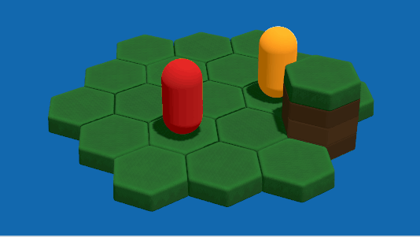
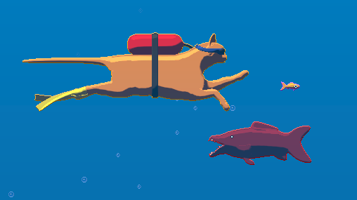

# Ghost Mesh Plugin for Godot C#

This plugin adds a new node type to the Godot editor, "GhostMesh". When added as the child of a MeshInstance3D, the GhostMesh renders another instance of its parent mesh, but with separate rendering layers and material.

Essentially this is the same as having a second MeshInstance3D node that shares the same mesh and skeleton, but is more convenient and automatically handles changes to the parent MeshInstance3D when running in the editor.
Because the GhostMesh shares the parent mesh and skeleton, any animations in the parent will also be reflected.

Setups with multiple viewports which are then combined in post-processing will find this useful. Here are two examples from my own projects where I use GhostMesh:
- Unit outlines. In my tactics game HoloWars, units are rendered again using a GhostMesh with an inverted-hull material. The base layer is then used as a stencil to cut out the center of the inverted-hull, leaving crisp outlines around highlighted units.

- Stylized pixel outlines. In my prototype game using 3D graphics rendered in a pixelated fake-2D style, objects are rendered again with a flat color on a separate layer and viewport. The flat colors are compared against neighbouring pixels to find edges, and the final result is composited over the main viewport to create pixel outlines.

